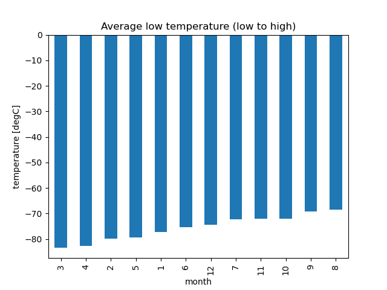
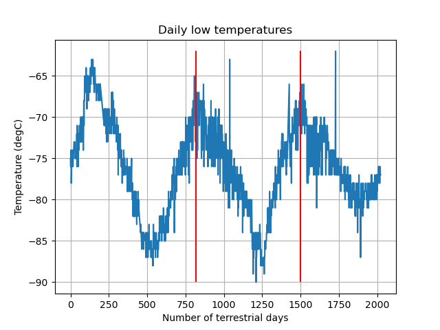

# scraping-challenge
Repository for Monash University Bootcamp Module 11

## File structure
- part_1_mars_news.ipynb contains the code for the first deliverable (Mars News)
- part_2_mars_weather.ipynb contains the code for the second deliverable (Mars Weather Data)
- Cleaned_Data is a directory containing the cleaned data from Deliverable 2 in a CSV file
- Output is a directory containing the PNG exports from the Deliverable 2 analysis and included in this README file

## Important note about the Jupyter notebooks
The notebooks do not contain any conclusion drawn from the data analysis apart from direct answers generated from the code. All the conclusions and final answers to the questions are included in this README file.

## Answers to questions
### How many months exist on Mars?
The answer is 12 months from the data. The answer was obtained by extracting the number of unique values from the dataset.

### How many Martian days' worth of data are there?
There are 1867 Martian days (sols) worth of data.

### Which month, on average, has the lowest temperature? The highest?
As shown in the figure below, the month with the lowest temperature is the third month. The one with the highest temperature is the eigth month.

The temperature range on Mars, based on this dataset, is -83 degC to -68 degC on average.

### Which month, on average, has the lowest atmospheric pressure? The highest?
As shown in the figure below, the month with the lowest pressure is the sixth month. The one with the highest pressure is the ninth month.

### How many terrestrial days exist in a Martian year?
Number of days between temperature peaks is around 1500 - 820 = 680 terrestrial days (this is within around 1% of the real value of 687 days). This is illustrated in the figure below, where the red vertical lines indicate the location of the peaks used to estimate the duration of a martian year. Trial and error was used to obtain these points.

